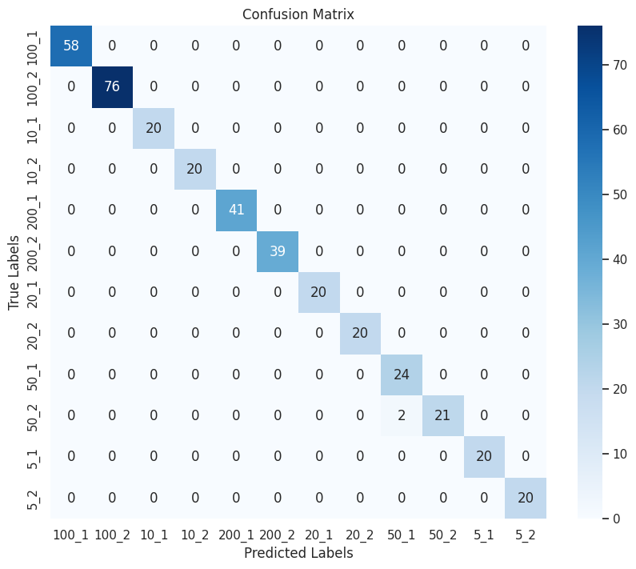

# Currency Denomination Recognition for the Visually Impaired

## Table of Contents

1.  [Introduction](#introduction)
2.  [Motivation](#motivation)
3.  [Prerequisites](#prerequisites)
4.  [Dataset Overview](#dataset-overview)
5.  [Data Processing](#data-processing)
6.  [Model Architecture](#model-architecture)
7.  [Hyperparameter Tuning](#hyperparameter-tuning)
8.  [Model Training](#model-training)
9.  [Evaluation](#evaluation)
10. [Implementation](#implementation)
11. [Usage](#usage)
12. [Conclusion and Future Scope](#conclusion-and-future-scope)
13. [Acknowledgments](#acknowledgments)
14. [References](#references)

## Introduction

This project develops a robust system that leverages deep learning techniques to recognize currency denominations and the specific faces of Euro banknotes, aiming to assist visually impaired individuals in their daily financial transactions.

## Motivation

The goal is to provide a tool that enhances the autonomy of visually impaired users by enabling them to independently identify currency denominations, fostering greater confidence and independence in financial dealings.

## Prerequisites

-   Python 3.8+
-   TensorFlow 2.11.0
-   Keras
-   Numpy
-   Pandas
-   Matplotlib

## Dataset Overview

The dataset, curated and maintained by Microsoft developers, comprises embeddings of various international currency denominations, focusing on Euro notes for this project. This rich dataset allows the model to learn distinctive features of each denomination, front and back.

## Data Processing

Filtering and processing steps are applied to focus on Euro banknote embeddings. Class imbalance is checked and addressed through stratified data splitting to ensure the model learns effectively across all categories.

## Model Architecture

The model uses a single hidden layer neural network architecture with dropout regularization, designed to process features extracted by the Banknote-Net encoder, a pre-trained model developed by Microsoft.

## Hyperparameter Tuning

A k-fold cross-validation approach is utilized to tune the hyperparameters with an emphasis on achieving the highest F1-score. The optimal configuration was found to be 384 units in the hidden layer with a dropout rate of 0.5.

## Model Training

The model is trained using the best hyperparameter settings identified, with performance monitored through accuracy and loss metrics across training and validation phases.

## Evaluation

The final model's performance is rigorously evaluated using classification reports and confusion matrices, highlighting its precision and robustness in real-world scenarios.

 

## Implementation
To see the project in action, visit the hosted Jupyter notebook on GitHub Pages:
[Explore the Live Notebook](https://acm40960.github.io/project-currency-denomination-recognition-23200555/)

## Usage

This project is intended for use in practical applications to assist visually impaired individuals with currency recognition, integrated into devices or apps like Microsoft's Seeing AI.

## Conclusion and Future Scope

This model not only serves its immediate purpose but also sets the groundwork for future adaptations to include more currency types and integration into accessible devices like smartphones and smart glasses.

## Acknowledgments

This project was made possible through the support of Microsoft and the use of the Banknote-Net dataset. Special thanks to the contributors of the Banknote-Net GitHub repository and all who supported this project.

## References

-   Takeda, F., Omatu, S. "High-speed currency recognition using neural networks." IEEE Transactions on Neural Networks.
-   Li, W., Li, Y., Luo, K. "Application of Image Processing Technology in RMB Currency Classification." IEEE Xplore Digital Library.
-   [Banknote-Net: Open Dataset for Assistive Currency Recognition](https://github.com/microsoft/banknote-net)
-   [Seeing AI Project by Microsoft](https://www.microsoft.com/en-us/ai/seeing-ai)
